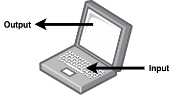
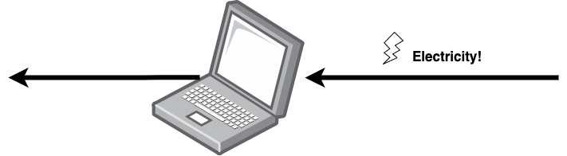
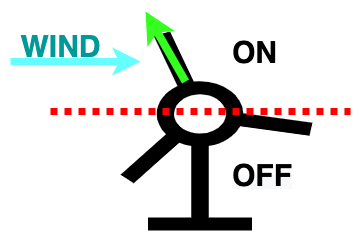
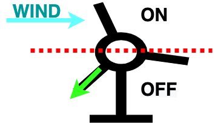
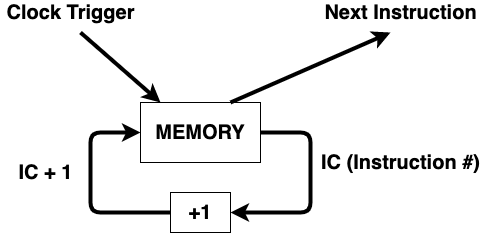

# Intro to computers!
Some chapters...
## What is a computer?

A computer is a device that remembers things, and updates based on inputs, and gives outputs. Like my laptop. It remembers things, I hit buttons on my keyboard (updates), and it shows stuff on the monitor (outputs).

#### Ok, fine fine, so how does it work?
1. First, electricity runs through the wires bringing power. Like a river:

1. Electricity powers the "clock". This is a circuit that is constantly turning on and off. And in my laptop, it flips more than 1 billion times a second. Think of it like a really fast windmill. (Or watermill if you like streams) 
 

1. The clock makes the computer run through a set of instructions stored in its memory.

1. Profit!!!!

### Case Study: Microsoft Word
TODO
## What is the internet?
TODO
### Case Study: Facebook.com
TODO
## Tell Me More about...
TODO
### Circuits!
TODO
### Computer Architecture
TODO
### Operating Systems
TODO
### My terminal?
TODO
### Continuations
TODO
### Machine learning
TODO
### Web servers
TODO
### Websites
TODO